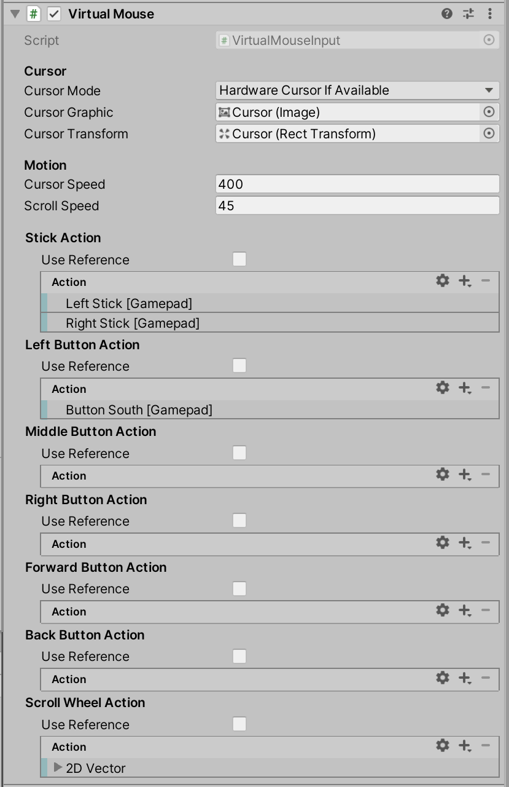

Rather than adapting UIs for gamepad navigation/use, an oft-used alternative is to instead keep having UIs operated by pointer input but to drive the pointer from gamepad input.

This sample demonstrates how to set this up with the input system.

1) It uses a custom [actions file](./GamepadMouseCursorUIActions.inputactions) for feeding input to the UI as the default actions are set up for gamepad navigation &ndash; something we don't want here as it would conflict with gamepad input being used for virtual cursor navigation.
2) Note how `InputSystemUIInputModule` on the `EventSystem` GameObject is set up to reference actions from that file.
3) The key component to take a look at is `VirtualMouseInput` on `Canvas >> Cursor`. The component is set up to receive input from the gamepad and translates it into motion on the `RectTransform` it is given. When going into play mode, you should also see a `Virtual Mouse` being added to the devices by the component.
4) Note how the anchor position on the `RectTransform` is set to bottom left. This way the coordinate system responds to how mouse screen space operates.
5) Note how `Cursor` is the last child of `Canvas` so that it draws on top of everything else.
6) Note that `Raycast Target` on the `Image` component of the cursor is turned off to avoid raycasts from the mouse cursor hitting the cursor itself.
7) Note that `Cursor Mode` on the `VirtualMouseInput` component is set to `Hardware Cursor If Available`. This will cause the component to look for a system mouse. If present, the system mouse is disabled and the system mouse cursor is warped to the virtual mouse position using `Mouse.WarpCursorPosition`. If no system mouse is present, `Cursor Graphic` will be used as a software mouse cursor.

# Licenses

The [cursor](./crosshair.png) used in the example is from [game-icons.net](https://game-icons.net/1x1/delapouite/crosshair.html) and made by [Delapuite](https://delapouite.com/) and released under the [CC BY 3.0 license](https://creativecommons.org/licenses/by/3.0/). It is used without modifications.
