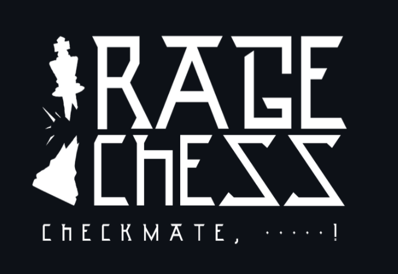

<!-- PROJECT SHIELDS -->
<!--
*** I'm using markdown "reference style" links for readability.
*** Reference links are enclosed in brackets [ ] instead of parentheses ( ).
*** See the bottom of this document for the declaration of the reference variables
*** for contributors-url, forks-url, etc. This is an optional, concise syntax you may use.
*** https://www.markdownguide.org/basic-syntax/#reference-style-links
-->
<!--
[![Contributors][contributors-shield]][contributors-url]
[![Forks][forks-shield]][forks-url]
[![Stargazers][stars-shield]][stars-url]
[![Issues][issues-shield]][issues-url]
[![LinkedIn][linkedin-shield]][linkedin-url]
-->

<!-- PROJECT LOGO -->
 

  

<!--  <h3 align="center">Best-README-Template</h3> -->

<!--
  

    An awesome README template to jumpstart your projects!
     
    <a href="https://github.com/othneildrew/Best-README-Template"><strong>Explore the docs »</strong></a>
     
     
    <a href="https://github.com/othneildrew/Best-README-Template">View Demo</a>
    ·
    <a href="https://github.com/othneildrew/Best-README-Template/issues">Report Bug</a>
    ·
    <a href="https://github.com/othneildrew/Best-README-Template/issues">Request Feature</a>
  
 -->

<!-- TABLE OF CONTENTS -->

  
Table of Contents

  <ol>
    <li>
      <a href="#about-the-project">About The Project</a>
      <ul>
        <li><a href="#built-with">Built With</a></li>
      </ul>
    </li>
    <li><a href="#installation">Installation</a>
    <li><a href="#roadmap">Roadmap</a></li>
    <li><a href="#contributing">Contributing</a></li>
    <li><a href="#authors">Authors</a></li>
    <li><a href="#acknowledgements">Acknowledgements</a></li>
  </ol>

<!-- ABOUT THE PROJECT -->
## About Rage Chess VR :chess_pawn:

  <b>Picture this...</b> 
You're in the middle of a chess match and your opponent strikes that sneaky move you should have seen coming. 
What's your emotional impulse? 
 
Flip the chess board and let the pieces fly across the room? :boom:  
Break the chess board with a hammer? :hammer:  
Pick up your trusty crossbow and shoot your king into the sky? :bow_and_arrow:  
 
  <i>Now you can!</i>
 
 Rage Chess is a virtual reality game that allows users to play chess and express their emotions throughout the game.  
  Choose single player to try your luck against the Stockfish bot, or choose multiplayer to play with friends!   
<i>A list of acknowledgments to the creators who helped blaze the trail for this project can be found at the end of this README.
  :smile:</i>
  

### Built With

Rage Chess was built with:
* [Unity 2021](https://unity3d.com/beta/2021.1a)
* [Oculus Quest 2](https://www.oculus.com/setup/)
* [Photon PUN 2](https://doc.photonengine.com/en-us/pun/current/getting-started/pun-intro#:~:text=Photon%20Unity%20Networking%20(PUN)%20is,be%20synced%20over%20the%20network.&text=The%20fast%20and%20(optionally)%20reliable,to%20connect%20one%20to%20one.)
* [Stockfish Chess Engine](https://stockfishchess.org/)
* [VRIF Virtual Reality Interaction Framework](https://wiki.beardedninjagames.com/#:~:text=Overview%20The%20VR%20Interaction%20Framework%20is%20a%20collection,their%20own%20interactable%20objects%20and%20be%20productive%20quickly.)

<!-- GETTING STARTED -->
## Installation

Instructions for Easy Installation on Oculus Quest 2:
1. Become an [Oculus Developer](https://developer.oculus.com/) (anyone can do it!)
2. Download [Oculus Developer Hub](https://developer.oculus.com/documentation/tools/odh/) to your computer
3. Download the APK from this repository to your computer (found under latest release)
4. Load the APK onto your device by dragging the APK file from your file manager into the Oculus Developer Hub app under "My Device"
5. RAGE!

If you want to clone the project to view it in the Unity Editor, install Unity version 2020.3.10

Also, if you want or need to create your own free PhotonPun account and server to play with an opponent/friend this is the resource we used to set up our online service. [Multiplayer Chess in Unity](https://www.youtube.com/watch?v=loun57ct5nM)

<!-- USAGE EXAMPLES -->
<!--## Usage

Use this space to show useful examples of how a project can be used. Additional screenshots, code examples and demos work well in this space. You may also link to more resources.

_For more examples, please refer to the [Documentation](https://example.com)_
-->

<!-- ROADMAP -->
## Roadmap

Next Steps / Stretch Goals
- [ ] Improve scoring system
- [ ] Implement legal chess moves
- [x] Single Player Mode
- [x] Voice Chat
- [ ] Additional Room Environments
- [ ] Customizable Avatars

<!-- CONTRIBUTING -->
## Contributing

Contributions are what make the open source community such an amazing place to be learn, inspire, and create. Any contributions you make are **greatly appreciated**.
 
When this project reached the size at which it required Github Large File Storage (LFS), the creators switched to working through Unity Collaborate. 
Since contributing directly to this code base through Github would not be an effective way to make updates to the project, please send us your feedback, suggestions, constructive criticism, or any other input.
 
Contact information for project creators can be found in the Authors section below.

<!-- CONTACT -->
## Authors

* Ayden Townsley - [Github](https://github.com/aydentownsley) - [@whoziwhatzit_](https://twitter.com/whoziwhatzit_) - aydentownsley@gmail.com
* Kyle Whitten - [Github](https://github.com/kwhit2) - [@kwhit212](https://twitter.com/kwhit212) - gigawhitt@gmail.com
* Peyton Smith - [Github](https://github.com/peytonbrsmith) - [@peytons0606](https://twitter.com/peytons0606) - peyton.smith@holbertonschool.com
* Valerie Nierenberg - [Github](https://github.com/valerienierenberg) - [@Val_Gal_Pal_](https://twitter.com/Val_Gal_Pal_) - valerie.nierenberg@gmail.com

Project Link: [https://github.com/aydentownsley/RageChess](https://github.com/aydentownsley/RageChess)

Landing Page: [Rage Chess](https://aydentownsley.github.io/RageChess)

<!-- ACKNOWLEDGEMENTS -->
## Acknowledgements
* [Valem - Youtube Channel](https://www.youtube.com/channel/UCPJlesN59MzHPPCp0Lg8sLw)
* [Justin P. Barnett - Youtube Channel](https://www.youtube.com/channel/UC1yXfU3c2gXchdmscjvCmMQ)
* [VR with Andrew - Youtube Channel](https://www.youtube.com/channel/UCG8bDPqp3jykCGbx-CiL7VQ)
* [8K Skybox Pack](https://assetstore.unity.com/packages/2d/textures-materials/sky/8k-skybox-pack-free-150926)
* [Wooden Crates](https://assetstore.unity.com/packages/3d/props/wooden-crates-16599)
* [HDRP Furniture Pack](https://assetstore.unity.com/packages/3d/props/furniture/hdrp-furniture-pack-153946)
* [Einstein Statue Pack](https://assetstore.unity.com/packages/3d/props/interior/free-statue-pack-152443)
* [Low Poly Chess Pack](https://assetstore.unity.com/packages/3d/props/low-poly-chess-pack-50405)
<!--* [GitHub Pages](https://pages.github.com)
* [Animate.css](https://daneden.github.io/animate.css)
* [Loaders.css](https://connoratherton.com/loaders)
* [Slick Carousel](https://kenwheeler.github.io/slick)
* [Smooth Scroll](https://github.com/cferdinandi/smooth-scroll)
* [Sticky Kit](http://leafo.net/sticky-kit)
* [JVectorMap](http://jvectormap.com)
* [Font Awesome](https://fontawesome.com)-->

<!-- MARKDOWN LINKS & IMAGES -->
<!-- https://www.markdownguide.org/basic-syntax/#reference-style-links -->
[contributors-shield]: https://img.shields.io/github/contributors/othneildrew/Best-README-Template.svg?style=for-the-badge
[contributors-url]: https://github.com/aydentownsley/RageChess/graphs/contributors
[forks-shield]: https://img.shields.io/github/forks/othneildrew/Best-README-Template.svg?style=for-the-badge
[forks-url]: https://github.com/aydentownsley/RageChess/network/members
[stars-shield]: https://img.shields.io/github/stars/othneildrew/Best-README-Template.svg?style=for-the-badge
[stars-url]: https://github.com/aydentownsley/RageChess/stargazers
[issues-shield]: https://img.shields.io/github/issues/othneildrew/Best-README-Template.svg?style=for-the-badge
[issues-url]: https://github.com/aydentownsley/RageChess/issues
[license-shield]: https://img.shields.io/github/license/othneildrew/Best-README-Template.svg?style=for-the-badge
[license-url]: https://github.com/aydentownsley/RageChess//blob/master/LICENSE.txt
<!-- [linkedin-shield]: https://img.shields.io/badge/-LinkedIn-black.svg?style=for-the-badge&logo=linkedin&colorB=555 -->
<!-- [linkedin-url]: https://linkedin.com/in/aydentownsley/ -->
[product-screenshot]: images/screenshot.png
