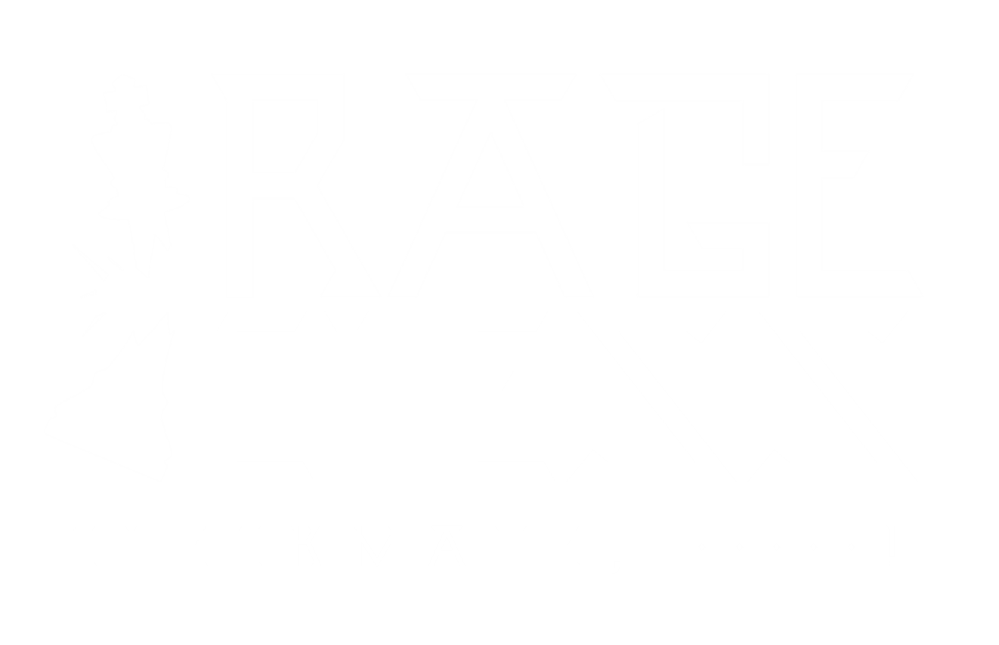

<!-- PROJECT SHIELDS -->
<!--
*** I'm using markdown "reference style" links for readability.
*** Reference links are enclosed in brackets [ ] instead of parentheses ( ).
*** See the bottom of this document for the declaration of the reference variables
*** for contributors-url, forks-url, etc. This is an optional, concise syntax you may use.
*** https://www.markdownguide.org/basic-syntax/#reference-style-links
-->
<!--
[![Contributors][contributors-shield]][contributors-url]
[![Forks][forks-shield]][forks-url]
[![Stargazers][stars-shield]][stars-url]
[![Issues][issues-shield]][issues-url]
[![LinkedIn][linkedin-shield]][linkedin-url]
-->

<!-- PROJECT LOGO -->
 

  

  <h3 align="center">Best-README-Template</h3>

<!--
  

    An awesome README template to jumpstart your projects!
     
    <a href="https://github.com/othneildrew/Best-README-Template"><strong>Explore the docs »</strong></a>
     
     
    <a href="https://github.com/othneildrew/Best-README-Template">View Demo</a>
    ·
    <a href="https://github.com/othneildrew/Best-README-Template/issues">Report Bug</a>
    ·
    <a href="https://github.com/othneildrew/Best-README-Template/issues">Request Feature</a>
  

-->

<!-- TABLE OF CONTENTS -->

  
Table of Contents

  <ol>
    <li>
      <a href="#about-the-project">About The Project</a>
      <ul>
        <li><a href="#built-with">Built With</a></li>
      </ul>
    </li>
    <li>
      <a href="#getting-started">Getting Started</a>
      <ul>
        <li><a href="#prerequisites">Prerequisites</a></li>
        <li><a href="#installation">Installation</a></li>
      </ul>
    </li>
    <li><a href="#usage">Usage</a></li>
    <li><a href="#roadmap">Roadmap</a></li>
    <li><a href="#contributing">Contributing</a></li>
    <li><a href="#license">License</a></li>
    <li><a href="#contact">Contact</a></li>
    <li><a href="#acknowledgements">Acknowledgements</a></li>
  </ol>

<!-- ABOUT THE PROJECT -->
## About RAGE CHESS VR :chess_pawn:

Picture this -- you're in the middle of a chess match and your opponent strikes that sneaky move you should have seen coming. 
What's your emotional impulse? 
Flip the chess board and let the pieces fly across the room? :boom:  
Break the chess board with a hammer? :hammer:  
Pick up your trusty crossbow and shoot your king into the sky? :bow_and_arrow:  
 
*Now you can!*
 
Rage Chess is a Multiplayer VR game built with Unity that allows users to play chess and express their emotions throughout the game.

:smile:

A list of acknowledgments to the creators who helped blaze the trail for this project can be found at the end of this README.

### Built With

This section should list any major frameworks that you built your project using. Leave any add-ons/plugins for the acknowledgements section. Here are a few examples.
* [Unity 2020.3.10](https://unity3d.com/unity/whats-new/2020.3.10)
* [Photon PUN 2](https://doc.photonengine.com/en-us/pun/current/getting-started/pun-intro#:~:text=Photon%20Unity%20Networking%20(PUN)%20is,be%20synced%20over%20the%20network.&text=The%20fast%20and%20(optionally)%20reliable,to%20connect%20one%20to%20one.)

<!-- GETTING STARTED -->
## Getting Started

This is an example of how you may give instructions on setting up your project locally.
To get a local copy up and running follow these simple example steps.

### Downloading the Code - Prerequisites

If you want to clone the project to view it in the Unity Editor, install Unity version 2020.3.10

### Easy Installation of APK on Quest 2

1. Become an Oculus Developer (anyone can do it!) https://developer.oculus.com/
2. Download Oculus Developer Hub to your computer https://developer.oculus.com/documentation/tools/odh/
3. Save the APK from this repository to your computer
4. Load the APK onto your device by dragging the APK file from your file manager into the Oculus Developer Hub app under "My Device"
5. RAGE!

<!-- USAGE EXAMPLES -->
<!--## Usage

Use this space to show useful examples of how a project can be used. Additional screenshots, code examples and demos work well in this space. You may also link to more resources.

_For more examples, please refer to the [Documentation](https://example.com)_
-->

<!-- ROADMAP -->
## Roadmap

See the [open issues](https://github.com/othneildrew/Best-README-Template/issues) for a list of proposed features (and known issues).

<!-- CONTRIBUTING -->
## Contributing

Contributions are what make the open source community such an amazing place to be learn, inspire, and create. Any contributions you make are **greatly appreciated**.

1. Fork the Project
2. Create your Feature Branch (`git checkout -b feature/AmazingFeature`)
3. Commit your Changes (`git commit -m 'Add some AmazingFeature'`)
4. Push to the Branch (`git push origin feature/AmazingFeature`)
5. Open a Pull Request

<!-- LICENSE -->
## License

Distributed under the MIT License. See `LICENSE` for more information.

<!-- CONTACT -->
## Authors

Ayden Townsley - [@whoziwhatzit_](https://twitter.com/whoziwhatzit_) - aydentownsley@gmail.com
Kyle Whitten - [@kwhit212](https://twitter.com/kwhit212) - gigawhitt@gmail.com
Peyton Smith - 
Valerie Nierenberg - [@Val_Gal_Pal_](https://twitter.com/Val_Gal_Pal_) - valerie.nierenberg@gmail.com

Project Link: [https://github.com/aydentownsley/RageChess](https://github.com/aydentownsley/RageChess)

<!-- ACKNOWLEDGEMENTS -->
## Acknowledgements
* [GitHub Emoji Cheat Sheet](https://www.webpagefx.com/tools/emoji-cheat-sheet)
* [Img Shields](https://shields.io)
* [Choose an Open Source License](https://choosealicense.com)
* [GitHub Pages](https://pages.github.com)
* [Animate.css](https://daneden.github.io/animate.css)
* [Loaders.css](https://connoratherton.com/loaders)
* [Slick Carousel](https://kenwheeler.github.io/slick)
* [Smooth Scroll](https://github.com/cferdinandi/smooth-scroll)
* [Sticky Kit](http://leafo.net/sticky-kit)
* [JVectorMap](http://jvectormap.com)
* [Font Awesome](https://fontawesome.com)

<!-- MARKDOWN LINKS & IMAGES -->
<!-- https://www.markdownguide.org/basic-syntax/#reference-style-links -->
[contributors-shield]: https://img.shields.io/github/contributors/othneildrew/Best-README-Template.svg?style=for-the-badge
[contributors-url]: https://github.com/aydentownsley/RageChess/graphs/contributors
[forks-shield]: https://img.shields.io/github/forks/othneildrew/Best-README-Template.svg?style=for-the-badge
[forks-url]: https://github.com/aydentownsley/RageChess/network/members
[stars-shield]: https://img.shields.io/github/stars/othneildrew/Best-README-Template.svg?style=for-the-badge
[stars-url]: https://github.com/aydentownsley/RageChess/stargazers
[issues-shield]: https://img.shields.io/github/issues/othneildrew/Best-README-Template.svg?style=for-the-badge
[issues-url]: https://github.com/aydentownsley/RageChess/issues
[license-shield]: https://img.shields.io/github/license/othneildrew/Best-README-Template.svg?style=for-the-badge
[license-url]: https://github.com/aydentownsley/RageChess//blob/master/LICENSE.txt
<!-- [linkedin-shield]: https://img.shields.io/badge/-LinkedIn-black.svg?style=for-the-badge&logo=linkedin&colorB=555 -->
<!-- [linkedin-url]: https://linkedin.com/in/aydentownsley/ -->
[product-screenshot]: images/screenshot.png
